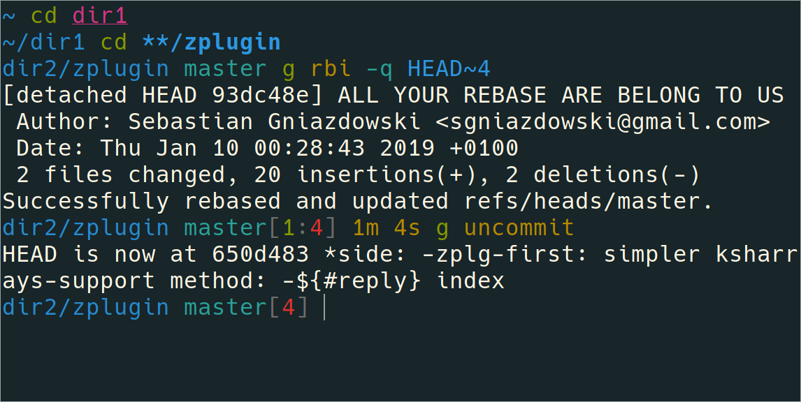

**NO LONGER MAINTAINED**:

I am now using Powerlevel10k as my theme,
see my Zsh dotfiles [here](https://gitlab.com/gamma-neodots/neodots.zsh/).


# Twodir (Fork of Pure)

> Pretty, compact, and fast ZSH prompt




## Overview

This prompt is based on [Pure by sindresorhus](https://github.com/sindresorhus/pure).

Most prompts are verbose and slow. I wanted something that fit in one line, ran asynchronously, and showed me all the information I needed.

### Why?

* Displays the current and parent directory, the full path is often too much for a single line, and the cwd is often not enough context.
* Displays the directory in a color indicating whether the user has ownership or write permissions. *(This is done natively, using the zsh/stat module!)*


- Comes with the best prompt character: no prompt character.
- Shows `git` branch and whether it's dirty (with a `*`).
- Indicates when you have unpushed/unpulled `git` commits and how many. *(Check is done asynchronously!)*
- Command execution time will be displayed if it exceeds the set threshold.
- Username and host only displayed when in an SSH session.
- Shows the current path in the window title and the current folder & command while a process is running.
- Uses the same variables and filenames as Pure for easy migration. (...and easy maintenance for me.)
- Makes an excellent starting point for your own custom prompt.

## Install

Can be installed with your favorite plugin manager. Requires Git 2.0.0+ and ZSH 5.2+. Older versions of ZSH are known to work, but they are **not** recommended.

### Manually

1. Clone this repo somewhere. Here we'll use `$HOME/.zsh/pure`.
2. Add the path of the cloned repo to `$fpath` in `$HOME/.zshrc`.

```sh
mkdir -p "$HOME/.zsh"
git clone https://github.com/xPMo/twodir-zsh-theme.git "$HOME/.zsh/twodir-theme"
fpath+=("$HOME/.zsh/twodir-theme")
```


## Getting started

Initialize the prompt system (if not so already) and choose `pure`:

```sh
# .zshrc
autoload -U promptinit; promptinit
prompt pure
```


## Options

| Option                           | Description                                                                                    | Default value  |
| :------------------------------- | :--------------------------------------------------------------------------------------------- | :------------- |
| **`PURE_CMD_MAX_EXEC_TIME`**     | The max execution time of a process before its run time is shown when it exits.                | `5` seconds    |
| **`PURE_GIT_PULL=0`**            | Prevents Pure from checking whether the current Git remote has been updated.                   |                |
| **`PURE_GIT_UNTRACKED_DIRTY=0`** | Do not include untracked files in dirtiness check. Mostly useful on large repos (like WebKit). |                |
| **`PURE_GIT_DELAY_DIRTY_CHECK`** | Time in seconds to delay git dirty checking when `git status` takes > 5 seconds.               | `1800` seconds |
| **`PURE_PROMPT_SYMBOL`**         | Defines the prompt symbol.                                                                     | `❯`            |
| **`PURE_PROMPT_VICMD_SYMBOL`**   | Defines the prompt symbol used when the `vicmd` keymap is active (VI-mode).                    | `❮`            |


## Colors

As explained in ZSH's [manual](http://zsh.sourceforge.net/Doc/Release/Zsh-Line-Editor.html#Character-Highlighting), color values can be:
- A decimal integer corresponding to the color index of your terminal. If your `$TERM` is `xterm-256color`, see this [chart](https://upload.wikimedia.org/wikipedia/commons/1/15/Xterm_256color_chart.svg).
- The name of one of the following nine colors: `black`, `red`, `green`, `yellow`, `blue`, `magenta`, `cyan`, `white`, and `default` (the terminal’s default foreground)
- `#` followed by an RGB triplet in hexadecimal format, for example `#424242`. Only if your terminal supports 24-bit colors (true color) or when the [`zsh/nearcolor` module](http://zsh.sourceforge.net/Doc/Release/Zsh-Modules.html#The-zsh_002fnearcolor-Module) is loaded.

Colors can be changed by using `[zstyle](http://zsh.sourceforge.net/Doc/Release/Zsh-Modules.html#The-zsh_002fzutil-Module)` with a pattern of the form `:prompt:pure:$color_name` and style `color`. The color names, their default, and what part they affect are:
- `execution_time` (yellow) - The execution time of the last command when exceeding `PURE_CMD_MAX_EXEC_TIME`.
- `git:ahead` (green) - If local repo has commits remote does not
- `git:behind` (red) - If remote repo has commits local does not
- `git:bracket` (242) - \[Brackets\] and colon surrounding ahead/behind count
- `git:branch` (cyan) - The name of the current branch when in a Git repository.
- `git:branch:cached` (red) - The name of the current branch when the data isn't fresh.
- `host` (242) - The hostname when on a remote machine.
- `path:user` (blue) - The current directory when the user has user ownership
- `path:group` (cyan) - ...when the user does not have user ownership, but does have group ownership
- `path:all` (yellow) - ...when the user does not have user/group ownership, but does have rwx permissions
- `path:none` (magenta) - ...when the user has no ownership and no rwx permissions
- `prompt:error` (red) - The `PURE_PROMPT_SYMBOL` when the previous command has *failed*.
- `prompt:success` (magenta) - The `PURE_PROMPT_SYMBOL` when the previous command has *succeded*.
- `user` (242) - The username when on remote machine.
- `user:root` (default) - The username when the user is root.
- `virtualenv` (242) - The name of the Python `virtualenv` when in use.

The following diagram shows where each color is applied on the prompt:

```
┌───────────────────────────────────────────── path
│          ┌────────────────────────────────── git:branch
│          │      ┌─────────────────────────── git:ahead
│          │      │ ┌───────────────────────── git:behind
│          │      │ │           ┌───────────── host
│          │      │ │           │
dev/pure master* [4:2] zaphod@heartofgold 42s
venv ❯           │ │ │   │                 │
│    │           │ │ │   │                 └── execution_time
│    │           │ │ │   └──────────────────── user
│    │           └─┴─┴──────────────────────── git:bracket
│    └──────────────────────────────────────── prompt
└───────────────────────────────────────────── virtualenv
```

### RGB colors

There are two ways to use RGB colors with the hexadecimal format. The correct way is to use a [terminal that support 24-bit colors](https://gist.github.com/XVilka/8346728) and enable this feature as explained in the terminal's documentation.

If you can't use such terminal, the module [`zsh/nearcolor`](http://zsh.sourceforge.net/Doc/Release/Zsh-Modules.html#The-zsh_002fnearcolor-Module) can be useful. It will map any hexadecimal color to the nearest color in the 88 or 256 color palettes of your termial, but without using the first 16 colors, since their values can be modified by the user. Keep in mind that when using this module you won't be able to display true RGB colors. It only allows you to specify colors in a more convenient way. The following is an example on how to use this module:

```sh
# .zshrc
zmodload zsh/nearcolor
zstyle :prompt:pure:path color '#FF0000'
```


## Example

```sh
# .zshrc

autoload -U promptinit; promptinit

# optionally define some options
PURE_CMD_MAX_EXEC_TIME=10

# change the path color
zstyle :prompt:pure:path color white

# change the color for both `prompt:success` and `prompt:error`
zstyle ':prompt:pure:prompt:*' color cyan

prompt pure
```


## Tips


To have commands colorized as seen in the screenshot, install [fast-syntax-highlighting](https://zdharma/fast-syntax-highlighting).


## Integration

### [oh-my-zsh](https://github.com/robbyrussell/oh-my-zsh)

1. Set `ZSH_THEME=""` in your `.zshrc` to disable oh-my-zsh themes.
2. Follow the Pure [Install](#install) instructions.
3. Do not enable the following (incompatible) plugins: `vi-mode`, `virtualenv`.

**NOTE:** `oh-my-zsh` overrides the prompt so Pure must be activated *after* `source $ZSH/oh-my-zsh.sh`.

<!-- TODO:
### [prezto](https://github.com/sorin-ionescu/prezto)

Pure is bundled with Prezto. No need to install it.

Add `prompt pure` to your `~/.zpreztorc`.

### [zim](https://github.com/Eriner/zim)

Pure is bundled with Zim. No need to install it.

Set `zprompt_theme='pure'` in `~/.zimrc`.
-->

### [antigen](https://github.com/zsh-users/antigen)

Update your `.zshrc` file with the following two lines (order matters). Do not use the `antigen theme` function.

```sh
antigen bundle mafredri/zsh-async
antigen bundle xPMo/twodir-zsh-theme
```

### [antibody](https://github.com/getantibody/antibody)

Update your `.zshrc` file with the following two lines (order matters):

```sh
antibody bundle mafredri/zsh-async
antibody bundle xPMo/twodir-zsh-theme
```

### [zplug](https://github.com/zplug/zplug)

Update your `.zshrc` file with the following two lines:

```sh
zplug mafredri/zsh-async, from:github
zplug xPMo/twodir-zsh-theme, use:pure.zsh, from:github, as:theme
```

### [zplugin](https://github.com/zdharma/zplugin)

Update your `.zshrc` file with the following two lines (order matters):

```sh
zplugin ice pick"async.zsh" src"pure.zsh"
zplugin light xPMo/twodir-zsh-theme
```


## FAQ

There are currently no FAQs.

See [FAQ Archive](https://github.com/xPMo/twodir-zsh-theme/wiki/FAQ-Archive) for previous FAQs.


## Ports

- **ZSH**
	- [therealklanni/purity](https://github.com/therealklanni/purity) - More compact current working directory, important details on the main prompt line, and extra Git indicators.
 	- [intelfx/pure](https://github.com/intelfx/pure) - Solarized-friendly colors, highly verbose, and fully async Git integration.
	- [dfurnes/purer](https://github.com/dfurnes/purer) - Compact single-line prompt with built-in Vim-mode indicator.
	- [chabou/pure-now](https://github.com/chabou/pure-now) - Fork with [Now](https://zeit.co/now) support.
	- [pure10k](https://gist.github.com/romkatv/7cbab80dcbc639003066bb68b9ae0bbf) - Configuration file for [Powerlevel10k](https://github.com/romkatv/powerlevel10k/) that makes it look like Pure.
- **Bash**
	- [sapegin/dotfiles](https://github.com/sapegin/dotfiles) - [Prompt](https://github.com/sapegin/dotfiles/blob/dd063f9c30de7d2234e8accdb5272a5cc0a3388b/includes/bash_prompt.bash) and [color theme](https://github.com/sapegin/dotfiles/tree/master/color) for Terminal.app.
- **Fish**
	- [brandonweiss/pure.fish](https://github.com/brandonweiss/pure.fish) - Pure-inspired prompt for Fish. Not intended to have feature parity.
	- [rafaelrinaldi/pure](https://github.com/rafaelrinaldi/pure) - Support for bare Fish and various framework ([Oh-My-Fish](https://github.com//oh-my-fish/oh-my-fish), [Fisherman](https://github.com//fisherman/fisherman), and [Wahoo](https://github.com//bucaran/wahoo)).
- **Rust (ZSH)**
	- [xcambar/purs](https://github.com/xcambar/purs) - Pure-inspired prompt in Rust.
- **Go**
	- [talal/mimir](https://github.com/talal/mimir) - Pure-inspired prompt in Go with Kubernetes and OpenStack cloud support. Not intended to have feature parity.
- **PowerShell**
	- [nickcox/pure-pwsh](https://github.com/nickcox/pure-pwsh/) - PowerShell/PS Core implementation of the Pure prompt.


## Team

[](http://sindresorhus.com) | [](https://github.com/mafredri)
---|---
[Sindre Sorhus](https://github.com/sindresorhus) | [Mathias Fredriksson](https://github.com/mafredri)
